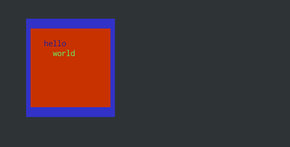

# Trikl

"Terminal React for Clojure" => Trikl

[](https://circleci.com/gh/lambdaisland/trikl) [](https://cljdoc.org/d/lambdaisland/trikl) [](https://clojars.org/lambdaisland/trikl)

Trikl lets you write terminal applications in a way that's similar to
React/Reagent. It's main intended use case is for hobbyist/indy games.

With Trikl you use (a dialect of) Hiccup to create your Terminal UI. As your
application state changes, Trikl re-renders the UI, diffs the output with what's
currently on the screen, and sends the necessary commands to the terminal to
bring it up to date.

This is still very much work in progress and subject to change.

## Example

Currently Trikl only works as a telnet server.

To try it out on the REPL you can do something like this:

``` clojure
(require '[trikl.core :as t])

;; store clients so we can poke at them from the REPL
(def clients (atom []))

;; Start the server on port 1357, as an accept handler just store the client in
;; the atom.
(def stop-server (t/start-server #(swap! clients conj %) 1357))

;; in a terminal: telnet localhost 1357

#_(stop-server) ;; disconnect all clients and stop listening for connections

;; Render hiccup! Re-run this as often as you like, only changes are sent to the client.
(t/render (last @clients)
          [:box {:x 10 :y 5 :width 20 :height 10 :styles {:bg [50 50 200]}}
           [:box {:x 1 :y 1 :width 18 :height 8 :styles {:bg [200 50 0]}}
            [:box {:x 3 :y 1}
             [:span {:styles {:fg [30 30 150]}} "hello\n"]
             [:span {:styles {:fg [100 250 100]}} "  world"]]]])

;; Listen for input events
(t/add-listener (last @clients)
                ::my-listener
                (fn [event]
                  (prn event)))
```

Result:



## True Color

In theory ANSI compatible terminals are able to render 24 bit colors (16 million
shades), but in practice they don't always do.

You can try this snippet, if you see nice continuous gradients from blue to
purple then you're all set.

``` clojure
(defn app [_]
  [:box
   (for [y (range 50)]
     [:span
      (for [x (range 80)]
        [:span {:styles {:bg [(* x 2) (* y 2) (+ x (* 4 y))]}} " "])
      "\n"])])
```

iTerm and gnome-terminal should both be fine, but if you're using Tmux and you're not getting the desired results, then add this to your `~/.tmux.conf`

``` conf
set -g default-terminal "xterm-256color"
set-option -ga terminal-overrides ",xterm-256color:Tc"
```

## License

Copyright &copy; 2018 Arne Brasseur

Licensed under the term of the Mozilla Public License 2.0, see LICENSE.
